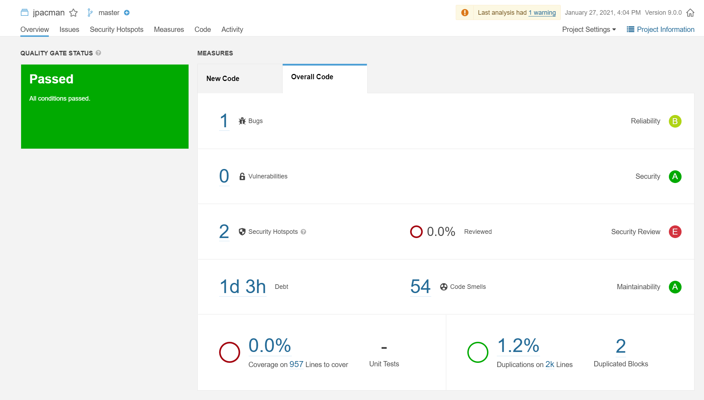

## Laboratoire 2 : Assistants de Refactoring
### LOG530 – Réingénierie du Logiciel
#### Date de remise : 11 février 2021 à 23h59

## 1. Objectifs
Le travail à réaliser dans ce laboratoire vise à explorer :
- Les différents outils disponibles pour l'assistance au refactoring. En utilisant des outils appropriés, nous pouvons planifier à l'avance les activités de refactoring qui pourraient améliorer notre système logiciel.
-	Les mauvaises odeurs (ou code smells en anglais) qui représentent des symptômes de problèmes de conception ou d’implémentation. Ces mauvaises odeurs nous donnent des indices sur où et comment refactoriser. Lors de la planification des activités de refactoring, gardez à l'esprit le patron « Keep it Simple » (livre Object-Oriented Reengineering Patterns OORP, p.37), et « Most valuable first » (OORP, p. 29).
-	Les opérations de refactoring à appliquer : consulter les catalogues de refactoring, se familiariser avec le refactoring via les IDEs et les outils avancés.

## 2. Matériel et outils à utiliser

### Outils de base
-	[IntelliJ IDEA](https://www.jetbrains.com/idea/)  (vous pouvez utiliser Eclipse, à votre discrétion, mais cela peut nécessiter des adaptations pour le projet que nous utilisons pendant les sessions de laboratoire)
-	Le projet [JPacman](https://github.com/hscrocha/jpacman).
-	[CodeScene](https://codescene.io/) : pas d’installation requise, mais il nécessite un compte GitHub. L'intégration de cet outil avec GitHub lui permet de visualiser vos répertoires de code. La partie dette technique (Technical Debt) affiche les cibles de refactoring. Les codes biomarqueurs (Code Biomarkers) montrent une analyse plus détaillée des odeurs (code smells), mais ce n'est disponible que pour les abonnements payants.
-	[SonarQube](https://www.sonarqube.org/) : un outil/plateforme d’inspection continue de la qualité du code.
-	Compte [GitHub](https://github.com/)

### Lectures de référence recommandées
-	Chapitre 2 « Setting Direction » du livre Object-Oriented Reengineering Patterns (disponible en PDF sous l’onglet Références dans Moodle) : page 29 (« Most valuable first »), et page 37 (« Keep it Simple »).

### Outils auxiliaires

Les outils auxiliaires **ne sont pas nécessaires** pour la réalisation de laboratoire, mais ils peuvent être utiles pour obtenir des informations supplémentaires (ou des alternatives) sur un projet. Vous pouvez les utiliser à votre discrétion.

-	[RefactoringMiner](https://github.com/tsantalis/RefactoringMiner) : un API/outil qui détecte l’historique des opérations de refactoring appliquées dans un projet (Java).
-	[PMD](https://pmd.github.io/) : un outil d'analyse du code source. Il permet de détecter certaines odeurs de code et mauvaises pratiques.
-	[SpotBugs](https://spotbugs.github.io/) : un outil de détection de bogues dans Java. Certaines de ses catégories de détection peuvent être considérées comme des odeurs de code (au lieu de bogues réels). Par conséquent, cet outil est utile pour trouver les odeurs de code et les mauvaises pratiques d'implémentation qui peuvent nécessiter du refactoring. Il s'agit de la continuation de l'outil [FindBugs](http://findbugs.sourceforge.net/) qui devient obseléte depuis 2015.
-	[CheckStyle](https://checkstyle.sourceforge.io/) : un outil de contrôle de code qui permet de vérifier le style du code source écrit en langage Java.
-	[JDeodorant](https://marketplace.eclipse.org/content/jdeodorant) : un plugin Eclipse qui détecte certaines odeurs de code et recommande des operations de refactoring appropriées pour les corriger. Il supporte les odeurs de code suivant: Type Checks, Feature Envy, God Class, Long Parameter List.  JDeodorant a récement une version de plugin spécifique pour IntelliJ nommée [IntelliJDeodorant](https://plugins.jetbrains.com/plugin/14016-intellijdeodorant).
-	[JMove](https://github.com/aserg-ufmg/jmove) : un autre plugin Eclipse, spécialisé pour le refactoring move method uniquement. Par conséquent, c'est un bon outil pour détecter et corriger l'odeur de code Feature Envy.

## 3. Installation et préparation

Pour faire ce laboratoire, préparer les outils de base indiqués dans la [ section 2 ](#outils)(pas les [outils auxiliaires](#auxiliaires), ils sont optionnels et ne seront pas utilisés dans ce laboratoire) 

Tout d'abord, assurez-vous de transférer (faire un "fork") du projet JPacman du [référentiel suivant](https://github.com/ouniali/jpacman) vers votre compte GitHub. Il est nécessaire de faire un fork du projet car la version gratuite de CodeScene voit que les projets de votre propre compte.

Ensuite, allez dans CodeScene et cliquez sur le menu "Login" (coin supérieur droit). Vous pouvez choisir l'option "Login with Github" au bas de cette page. Une fois connecté, vous pouvez choisir de créer un nouveau projet où CodeScene affichera tous les projets GitHub de votre compte. Sélectionnez JPacman et passez à la partie suivante jusqu'à ce qu'elle se termine (cela peut prendre un certain temps, selon le projet).

Téléchargez/Clonez le projet JPacman et ouvrez-le sur IntelliJ; lancer le build. JPacman utilise Gradle comme gestionnaire de build/dépendances. Assurez-vous de pouvoir faire le build et l'exécuter avant de modifier le code source.

## 4. Travail à réaliser

### Partie 1 : JPacman avec CodeSence

Pour notre première tâche, nous allons utiliser CodeScene pour identifier quels artefacts ont besoin de réusinage. Vous devriez déjà avoir JPacman dans votre CodeScene tel que expliqué dans la [ Section 3 (Installation et préparation)](#installation).

Cliquez dans le menu "Code" sur le côté gauche, puis cliquez sur "Hotspots" pour vosualiser du code. Dans cette visualisation, les hotspots sont des artefacts avec de nombreuses activités de comits. Sur cette visualisation, vous pouvez consulter l'onglet "Refactoring targets". Regardez les candidats de refactoring recommandés.

Cliquez maintenant dans le sous-menu "Hotspot Code Health" (sous "Code") sur le côté gauche. Cela montre une liste des fichiers recommandés pour le refactoring. Sélectionnez un des fichiers dans la liste, puis cliquez sur le bouton "X-ray" puis "Run X-Ray" pour voir plus de détails sur la complexité au niveau des méthodes (l'exécution peut prendre de quelques à plusieurs minutes avant que l'outil affiche de résultat de l'analyse, dépendament de la taille et la complexité du fichier analysé). Regarder, les couleurs pour les méthodes (par exemple, les méthodes en jaune pour la classe ``MapParser.java``).

Questions:

1. CodeScene vous a-t-il aidé à identifier les cibles possibles pour le refactoring? Si oui, donner la liste d'artéfacts (classes et/ou méthodes) qui ont besoin de refactoring?

2. CodeScene vous a-t-il donné des recommandations ou des indices sur la façon de refactoriser les cibles proposées? Comment serait-il possible de procéder avec le refactoring?

### Partie 2 : JPacman avec SonarQube

Pour la deuxième partie, nous allons utiliser un outil plus complexe et dédié pour trouver des cibles de refactoring. 
Téléchargez [SonarQube](https://www.sonarqube.org/) (si vous ne l'avez pas déjà fait) et décompressez-le sur votre ordinateur.

**NB.** La version actuelle de *sonarqube-8.6.0* est compatible ***uniquement*** avec [Oracle JRE 11](https://www.oracle.com/java/technologies/javase/jdk11-archive-downloads.html) ou OpenJDK 11. Assurez-vous d'avoir la bonne version version de java 11 dans le fichier de configuration "wrapper.conf" sous le dossier "conf" de votre dossier SonarQube (par exemple, si votre version java est jdk-11.0.9, donc vous devez avoir ``wrapper.java.command=C:\Program Files\Java\jdk-11.0.9\bin\java``).

Nous devrons utiliser la ligne de commande pour démarrer l'outil SonarQube. Ouvrez un terminal (invite de commande sous Windows) et assurez-vous que vous vous trouvez actuellement dans le dossier SonarQube. Ensuite, vous devriez aller dans le dossier bin comme par exemple: 
``
cd bin
``
Dans le dossier "bin" de SonarQube, vous trouverez des dossiers spécifiques pour chaque système d'exploitation. Accédez au dossier correspondant au système d'exploitation de votre machine. Par exemple, sur une machine exécutant Windows 64 bits, la commande sera:
``
cd windows-x86-64
``
Maintenant, vous pouvez exécuter SonarQube via la commande :

[ Windows ] ``StartSonar.bat ``
[ Linux / Mac ] ``./sonar.sh console ``

Si vous rencontrez des problèmes, veuillez consulter la [documentation SonarQube](https://docs.sonarqube.org/latest/setup/get-started-2-minutes/)). Si tout s'est bien déroulé, alors vous devriez voir dans votre terminal un message comme *"<date> INFO yyy [ xxxx ] SonarQube is up"*. Ouvrez maintenant votre navigateur et saisissez l'adresse suivante dessous: 

``
http://localhost:9000
``

Cliquez sur ``Log In`` (coin supérieur droit). L'identifiant et le mot de passe est "admin" (vous pouvez changer plus tard le mot de passe si vous le souhaitez). Après la connexion, vous pouvez cliquer sur ``Create New Project``. Pour le Project ``Key`` et ``Display``, tapez "JPacman" (si vous changez le nom, vous devrez adapter d'autres commandes plus tard, car ils utilisent la clé pour identifier le projet).

Maintenant, vous verrez la page ``Analyze your Project``. Dans la première étape, pour le nom de token, tapez ``jpacmantoken``. Cliquez sur ``generate`` puis ``continue`` (rappelez-vous ce code généré pour l'étape 2).

Si tout allait bien, alors vous devriez voir l'étape 2. Sélectionnez ``Java`` puis ``Gradle``. Vous pouvez suivre les instructions données mais pour cette session de laboratoire, vous pouvez simplement continuer à suivre ici. La première chose à faire est donc de mettre à jour votre fichier Gradle de construction (si vous avez récupéré la dernière version du référentiel, ce n'est pas nécessaire). Ouvrez votre IntelliJ avec le code source de JPacman, et dans le dossier racine du projet, vous trouverez le fichier ``build.gradle``. Assurez vous d'avoir la bonne version: ouvrez le fichier et ajoutez cette ligne après la ligne 7 (à l'intérieur de l'élément ``plugins``):

``
id "org.sonarqube" version "3.0"
``

Vous pouvez maintenant utiliser le terminal à l'intérieur d'IntelliJ pour la commande donnée par SonarQube, placez-les tous sur la même ligne (adaptez la commande en conséquence pour Windows):

``
gradlew sonarqube -Dsonar.projectKey=JPacman -Dsonar.host.url=http://localhost:9000 -Dsonar.login==<generated token code>
``

**NB.** Sur Mac, utilisez ``./gradlew`` au lieu de ``gradlew``.

Si vous rencontrez des problèmes avec la commande ci-dessus, essayez plutôt celle-ci:

``
./gradlew sonarqube -Dsonar.projectKey=JPacman  
  -Dsonar.host.url=http://localhost:9000 -Dsonar.login=admin -Dsonar.password=admin
``

**NB.** Assurez-vous d'avoir la bonne version de java dans ``sourceCompatibility`` et ``targetCompatibility`` dans le fichier ``gradle.properties`` du projet JPacman.

Si tout va bien, la page sur SonarQube devrait être mise à jour dans un certain temps avec les informations du code source de JPacman. Voici une capture d'écran de SonarQube une fois l'analyse terminée sur JPacman.

Cliquez sur "Code Smells" et analysez les odeurs détectées. Vous pouvez également voir que SonarQube donne aussi des explications sur les odeurs ("Why this is an issue?").

Questions:

1. Donnner la liste des artéfacts (classes et/ou méthodes) qui ont besoin de refactoring.

2. Parmis CodeScene et SonarQube, lequel est plus utile pour trouver des cibles de refactoring?

3. Parmis CodeScene et SonarQube, lequel fournit le meilleur raisonnement / explication sur les cibles de refactoring possibles?

4. Existe-t-il des artefacts communs entre SonarQube (``Code Smells``) et CodeScene (``Refactoring targets``)?

### Partie 3 : Refactoring stratégique avec JPacman

Pour le cours de réingénierie de logiciel, nous valorisons le concept de *refactoring stratégique*, qui consiste à refactoriser avec un objectif. Les outils peuvent aider à identifier les artefacts dont les odeurs pourraient entraîner des problèmes potentiels. Cependant, seul le développeur peut vraiment identifier les artefacts nécessaires pour un objectif spécifique. Faisons cela pour JPacman.

Comme vous l'avez probablement remarqué, il manque à JPacman de nombreuses fonctionnalités présentes dans le jeu Pacman original. Maintenant, l'idée est de commencer à refactoriser le code pour prendre en charge l'une de ces fonctionnalités manquantes: plus de vies (Extra Lives). Dans le Pacman original, le joueur commence avec 3 vies. Dans JPacman, il n'y a qu'une seule vie et en cas de perte: game over. Si vous regardez le code (``Player.java``), il n'y a pas d'attribut pour stocker le nombre de vies qu'il reste au joueur.

Regardez les artefacts de JPacman et planifiez la ou les refactorings nécessaires pour faciliter l'ajout de plusieurs vies. Vous pouvez commencer par les refactorings les plus simples pour ne pas altérer le code ou procédez de façon raisonnable selon le patron « The Most Valuable First ». Il n'y a pas de mauvaise direction ici, faites ce que vous pensez être le plus facile ou le plus logique pour vous. Veuillez noter que vous n'avez qu'à "**planifier**" les refactorings pour ce laboratoire. (L'application des refactorings est pour la [prochaine partie](#application))

**N.B** La planification est ce qui le plus important pour la partie 3.

Questions:

1. Quelles est votre stratégie pour planifier ce refactoring?

2. Pourquoi considérez-vous ces refactorings comme importantes pour votre objectif?

3. Les outils précédents (CodeScene ou SonarQube) ont-ils identifié les cibles de refactoring que vous jugiez nécessaires pour atteindre cet objectif?

4. Préférez-vous refactoriser uniquement pour améliorer la qualité du code ou refactoriser avec un objectif? Pourquoi?

### Partie 4 (optionnelle) : Refactoring stratégique de JPacman

Pour cette partie optionnelle, vous appliquez les refactorings planifiés (dans la Partie 3) sur le code source. N'oubliez pas de vous assurer que vos refactorings ne brisent pas le code.

## 5. Conditions de réalisation
Le travail est à effectuer en équipes de 3 étudiants au maximum.

## 6. Aide et discussions
Vous êtes encouragés à discuter du laboratoire et à poser vos questions en utilisant le forum créé à cette fin sur Moodle ou sur Discord. Les membres de chaque équipe sont encouragés à utiliser les channels privés (textuel et vocal) créés pour leur équipe sur Discord pour discuter et travailler en équipe sur les différentes activités du laboratoire.

## 7. Remise
Le travail doit être remis électroniquement sur Moodle au plus tard le **11 février à 23h59**. Vous devrez remettre une archive zip ou tar.gz contenant tous les fichiers, ainsi qu’un fichier texte indiquant le nom de tous les membres de l’équipe ayant contribué à la réalisation du travail. 
Une seule remise électronique est nécessaire par équipe. Remettez aussi individuellement le tableau de contribution tel vu dans le laboratoire précédent.
Pour faciliter la correction, vous devez nommer vos fichiers de la façon suivante :

``
LOG530H2021-LabXX-EquipeYY-CodePermanent1_CodePermanent2_CodePermanent3
``

